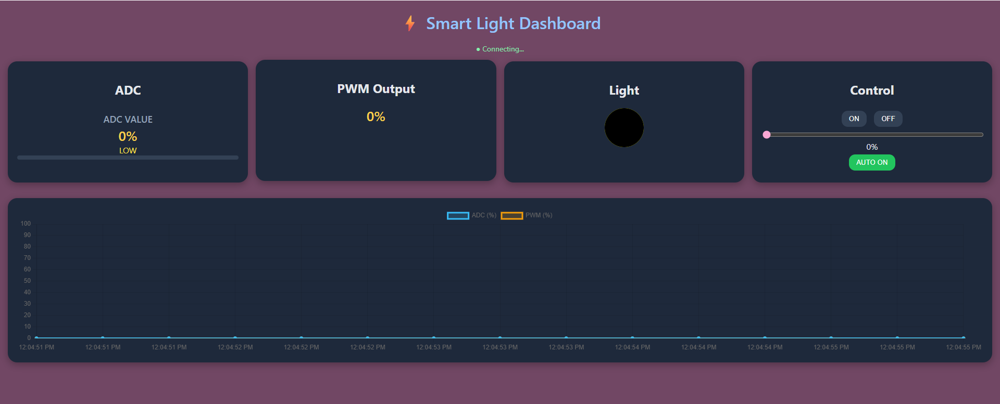

# Smart Light Dashboard

## Group Information

| | |
|---|---|
| The Panda Express | |
| Member 1 | Praphasiri Prasad 67070504007 |
| Member 2 | Waratchaya Thongkham 67070504012 |
| Member 3 | Nicole Gabrielle Edios Paracale 67070504032 |
| Course | INC272: Web-Based IoT Applications (2026) |


* * *

## Project Goal

This application is a Smart Light Dashboard that monitors ambient light levels via an ADC sensor and automatically controls LED brightness through PWM output. Users can also override the system manually to turn the light on/off or adjust brightness with a slider.

* * *

## Simulator Features Used

- [ ] LED — 4 channels, toggle on/off
- [ ] PSW — 4 push switches, read state
- [x] ADC — 4 analog channels, read sensor values
- [x] PWM — 4 channels, control duty ratio

* * *

## Interface Features

### Monitoring Elements

| Element | What It Shows | Simulator Feature |
|---------|--------------|-------------------|
| ADC Value display | Current ADC reading as a percentage (0–100%) | ADC ch.0 |
| ADC Status label | Threshold state — LOW / NORMAL / HIGH | ADC ch.0 |
| Progress bar | Visual fill representing ADC level | ADC ch.0 |
| PWM Output display | Current PWM duty cycle as a percentage | PWM |
| Light bulb indicator | Glowing circle that brightens/dims with PWM output | PWM |
| Real-time line chart | Scrolling graph of ADC (%) and PWM (%) over time | ADC ch.0 / PWM |

### Control Elements

| Element | What It Does | Command Sent |
|---------|-------------|--------------|
| ON button | Sets brightness to 100%, switches to manual mode | PWM duty 100% |
| OFF button | Sets brightness to 0%, switches to manual mode | PWM duty 0% |
| Brightness slider | Adjusts target brightness manually (0–100%) | PWM duty (slider value)% |
| AUTO mode | Automatically follows ADC sensor reading (default) | — (no command; uses ADC value) |

* * *

## How to Run

1. Start the mock hardware server:
   ```bash
   cd simulator/mock-hardware-server
   npm start
   ```
2. Open `index.html` using VS Code Live Server.
3. Check the browser console — a WebSocket connection message should appear.
4. Check the server terminal — `[CONNECT]` should be printed.

* * *

## File Structure

```
project-folder/
├── index.html      — main dashboard page (ADC display, PWM display, controls, chart)
├── main.js         — WebSocket logic, ADC reading, PWM control, chart updates, manual/auto mode
└── style.css       — dark-theme styling, card layout, progress bar, light bulb, responsive grid
```

* * *

## Known Limitations

- Only ADC channel 0 is read; the remaining three ADC channels are unused.
- PWM commands are simulated client-side with a smoothing animation and are not explicitly sent back to the hardware server via WebSocket.

* * *

## Screenshots

